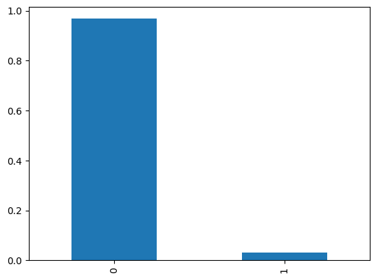
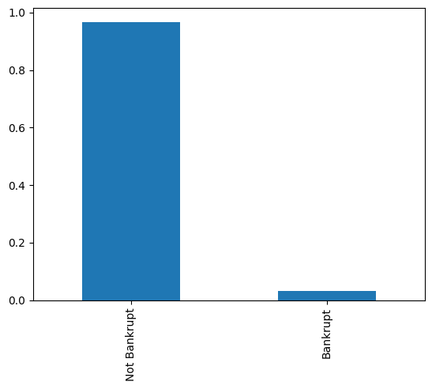
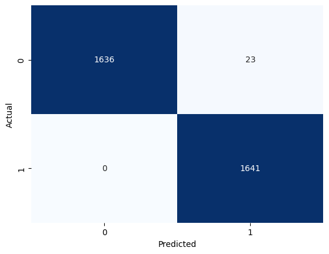
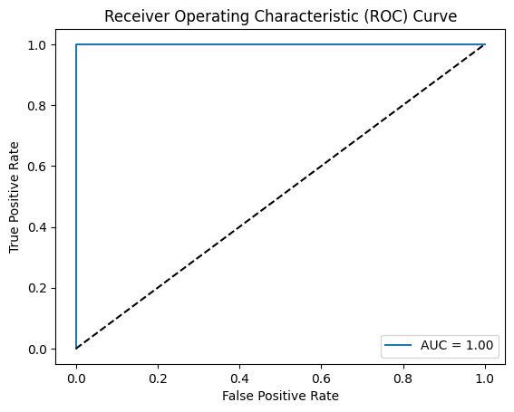
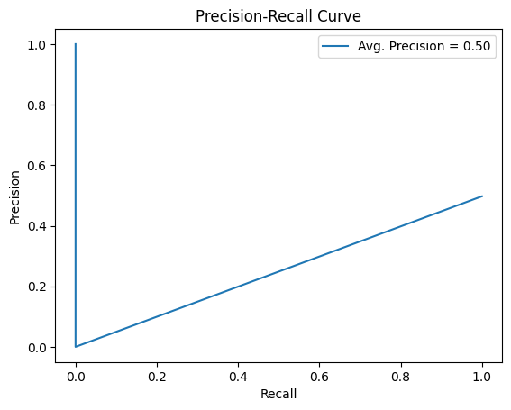

```python
import pandas as pd
import numpy as np
```


```python
df = pd.read_csv("./data.csv")
df.info()
```

    <class 'pandas.core.frame.DataFrame'>
    RangeIndex: 6819 entries, 0 to 6818
    Data columns (total 96 columns):
     #   Column                                                    Non-Null Count  Dtype  
    ---  ------                                                    --------------  -----  
     0   Bankrupt?                                                 6819 non-null   int64  
     1    ROA(C) before interest and depreciation before interest  6819 non-null   float64
     2    ROA(A) before interest and % after tax                   6819 non-null   float64
     3    ROA(B) before interest and depreciation after tax        6819 non-null   float64
     4    Operating Gross Margin                                   6819 non-null   float64
     5    Realized Sales Gross Margin                              6819 non-null   float64
     6    Operating Profit Rate                                    6819 non-null   float64
     7    Pre-tax net Interest Rate                                6819 non-null   float64
     8    After-tax net Interest Rate                              6819 non-null   float64
     9    Non-industry income and expenditure/revenue              6819 non-null   float64
     10   Continuous interest rate (after tax)                     6819 non-null   float64
     11   Operating Expense Rate                                   6819 non-null   float64
     12   Research and development expense rate                    6819 non-null   float64
     13   Cash flow rate                                           6819 non-null   float64
     14   Interest-bearing debt interest rate                      6819 non-null   float64
     15   Tax rate (A)                                             6819 non-null   float64
     16   Net Value Per Share (B)                                  6819 non-null   float64
     17   Net Value Per Share (A)                                  6819 non-null   float64
     18   Net Value Per Share (C)                                  6819 non-null   float64
     19   Persistent EPS in the Last Four Seasons                  6819 non-null   float64
     20   Cash Flow Per Share                                      6819 non-null   float64
     21   Revenue Per Share (Yuan ¥)                               6819 non-null   float64
     22   Operating Profit Per Share (Yuan ¥)                      6819 non-null   float64
     23   Per Share Net profit before tax (Yuan ¥)                 6819 non-null   float64
     24   Realized Sales Gross Profit Growth Rate                  6819 non-null   float64
     25   Operating Profit Growth Rate                             6819 non-null   float64
     26   After-tax Net Profit Growth Rate                         6819 non-null   float64
     27   Regular Net Profit Growth Rate                           6819 non-null   float64
     28   Continuous Net Profit Growth Rate                        6819 non-null   float64
     29   Total Asset Growth Rate                                  6819 non-null   float64
     30   Net Value Growth Rate                                    6819 non-null   float64
     31   Total Asset Return Growth Rate Ratio                     6819 non-null   float64
     32   Cash Reinvestment %                                      6819 non-null   float64
     33   Current Ratio                                            6819 non-null   float64
     34   Quick Ratio                                              6819 non-null   float64
     35   Interest Expense Ratio                                   6819 non-null   float64
     36   Total debt/Total net worth                               6819 non-null   float64
     37   Debt ratio %                                             6819 non-null   float64
     38   Net worth/Assets                                         6819 non-null   float64
     39   Long-term fund suitability ratio (A)                     6819 non-null   float64
     40   Borrowing dependency                                     6819 non-null   float64
     41   Contingent liabilities/Net worth                         6819 non-null   float64
     42   Operating profit/Paid-in capital                         6819 non-null   float64
     43   Net profit before tax/Paid-in capital                    6819 non-null   float64
     44   Inventory and accounts receivable/Net value              6819 non-null   float64
     45   Total Asset Turnover                                     6819 non-null   float64
     46   Accounts Receivable Turnover                             6819 non-null   float64
     47   Average Collection Days                                  6819 non-null   float64
     48   Inventory Turnover Rate (times)                          6819 non-null   float64
     49   Fixed Assets Turnover Frequency                          6819 non-null   float64
     50   Net Worth Turnover Rate (times)                          6819 non-null   float64
     51   Revenue per person                                       6819 non-null   float64
     52   Operating profit per person                              6819 non-null   float64
     53   Allocation rate per person                               6819 non-null   float64
     54   Working Capital to Total Assets                          6819 non-null   float64
     55   Quick Assets/Total Assets                                6819 non-null   float64
     56   Current Assets/Total Assets                              6819 non-null   float64
     57   Cash/Total Assets                                        6819 non-null   float64
     58   Quick Assets/Current Liability                           6819 non-null   float64
     59   Cash/Current Liability                                   6819 non-null   float64
     60   Current Liability to Assets                              6819 non-null   float64
     61   Operating Funds to Liability                             6819 non-null   float64
     62   Inventory/Working Capital                                6819 non-null   float64
     63   Inventory/Current Liability                              6819 non-null   float64
     64   Current Liabilities/Liability                            6819 non-null   float64
     65   Working Capital/Equity                                   6819 non-null   float64
     66   Current Liabilities/Equity                               6819 non-null   float64
     67   Long-term Liability to Current Assets                    6819 non-null   float64
     68   Retained Earnings to Total Assets                        6819 non-null   float64
     69   Total income/Total expense                               6819 non-null   float64
     70   Total expense/Assets                                     6819 non-null   float64
     71   Current Asset Turnover Rate                              6819 non-null   float64
     72   Quick Asset Turnover Rate                                6819 non-null   float64
     73   Working capitcal Turnover Rate                           6819 non-null   float64
     74   Cash Turnover Rate                                       6819 non-null   float64
     75   Cash Flow to Sales                                       6819 non-null   float64
     76   Fixed Assets to Assets                                   6819 non-null   float64
     77   Current Liability to Liability                           6819 non-null   float64
     78   Current Liability to Equity                              6819 non-null   float64
     79   Equity to Long-term Liability                            6819 non-null   float64
     80   Cash Flow to Total Assets                                6819 non-null   float64
     81   Cash Flow to Liability                                   6819 non-null   float64
     82   CFO to Assets                                            6819 non-null   float64
     83   Cash Flow to Equity                                      6819 non-null   float64
     84   Current Liability to Current Assets                      6819 non-null   float64
     85   Liability-Assets Flag                                    6819 non-null   int64  
     86   Net Income to Total Assets                               6819 non-null   float64
     87   Total assets to GNP price                                6819 non-null   float64
     88   No-credit Interval                                       6819 non-null   float64
     89   Gross Profit to Sales                                    6819 non-null   float64
     90   Net Income to Stockholder's Equity                       6819 non-null   float64
     91   Liability to Equity                                      6819 non-null   float64
     92   Degree of Financial Leverage (DFL)                       6819 non-null   float64
     93   Interest Coverage Ratio (Interest expense to EBIT)       6819 non-null   float64
     94   Net Income Flag                                          6819 non-null   int64  
     95   Equity to Liability                                      6819 non-null   float64
    dtypes: float64(93), int64(3)
    memory usage: 5.0 MB
    


```python
df["Bankrupt?"].value_counts(normalize=True).plot(kind='bar')
```


    <AxesSubplot:>


    

    


```python
df["Bankruptdesc"] = df["Bankrupt?"].map({
    0 : "Not Bankrupt",
    1 : "Bankrupt"
})
```


```python
df["Bankruptdesc"].value_counts(normalize=True).plot(kind='bar')
```


    <AxesSubplot:>


    

    


### Down sampling


```python
from sklearn.utils import resample

# Example: Under-sampling the majority class
minority_class = df[df['Bankrupt?'] == 1]
majority_class = df[df['Bankrupt?'] == 0]

majority_class_downsampled = resample(majority_class, replace=False, n_samples=len(minority_class), random_state=42)

balanced_df = pd.concat([majority_class_downsampled, minority_class])

```


```python
balanced_df.drop("Bankruptdesc", axis=1, inplace=True)
```


```python
balanced_df
```


<div>
<style scoped>
    .dataframe tbody tr th:only-of-type {
        vertical-align: middle;
    }

    .dataframe tbody tr th {
        vertical-align: top;
    }

    .dataframe thead th {
        text-align: right;
    }
</style>
<table border="1" class="dataframe">
  <thead>
    <tr style="text-align: right;">
      <th></th>
      <th>Bankrupt?</th>
      <th>ROA(C) before interest and depreciation before interest</th>
      <th>ROA(A) before interest and % after tax</th>
      <th>ROA(B) before interest and depreciation after tax</th>
      <th>Operating Gross Margin</th>
      <th>Realized Sales Gross Margin</th>
      <th>Operating Profit Rate</th>
      <th>Pre-tax net Interest Rate</th>
      <th>After-tax net Interest Rate</th>
      <th>Non-industry income and expenditure/revenue</th>
      <th>...</th>
      <th>Net Income to Total Assets</th>
      <th>Total assets to GNP price</th>
      <th>No-credit Interval</th>
      <th>Gross Profit to Sales</th>
      <th>Net Income to Stockholder's Equity</th>
      <th>Liability to Equity</th>
      <th>Degree of Financial Leverage (DFL)</th>
      <th>Interest Coverage Ratio (Interest expense to EBIT)</th>
      <th>Net Income Flag</th>
      <th>Equity to Liability</th>
    </tr>
  </thead>
  <tbody>
    <tr>
      <th>2236</th>
      <td>0</td>
      <td>0.471945</td>
      <td>0.540667</td>
      <td>0.523636</td>
      <td>0.607518</td>
      <td>0.607518</td>
      <td>0.999034</td>
      <td>0.797471</td>
      <td>0.809381</td>
      <td>0.303531</td>
      <td>...</td>
      <td>0.801098</td>
      <td>0.002294</td>
      <td>0.623034</td>
      <td>0.607520</td>
      <td>0.840529</td>
      <td>0.281733</td>
      <td>0.026791</td>
      <td>0.565159</td>
      <td>1</td>
      <td>0.023960</td>
    </tr>
    <tr>
      <th>5538</th>
      <td>0</td>
      <td>0.507093</td>
      <td>0.554187</td>
      <td>0.558702</td>
      <td>0.611972</td>
      <td>0.611986</td>
      <td>0.999132</td>
      <td>0.797542</td>
      <td>0.809430</td>
      <td>0.303451</td>
      <td>...</td>
      <td>0.808595</td>
      <td>0.002987</td>
      <td>0.625407</td>
      <td>0.611967</td>
      <td>0.840884</td>
      <td>0.277676</td>
      <td>0.026885</td>
      <td>0.565571</td>
      <td>1</td>
      <td>0.042552</td>
    </tr>
    <tr>
      <th>4593</th>
      <td>0</td>
      <td>0.503924</td>
      <td>0.550425</td>
      <td>0.556936</td>
      <td>0.605788</td>
      <td>0.605788</td>
      <td>0.999048</td>
      <td>0.797459</td>
      <td>0.809370</td>
      <td>0.303481</td>
      <td>...</td>
      <td>0.806939</td>
      <td>0.001287</td>
      <td>0.624203</td>
      <td>0.605785</td>
      <td>0.840704</td>
      <td>0.276773</td>
      <td>0.026811</td>
      <td>0.565249</td>
      <td>1</td>
      <td>0.056514</td>
    </tr>
    <tr>
      <th>6315</th>
      <td>0</td>
      <td>0.451275</td>
      <td>0.498528</td>
      <td>0.503346</td>
      <td>0.598438</td>
      <td>0.598438</td>
      <td>0.998972</td>
      <td>0.797280</td>
      <td>0.809214</td>
      <td>0.303326</td>
      <td>...</td>
      <td>0.771691</td>
      <td>0.008026</td>
      <td>0.623244</td>
      <td>0.598436</td>
      <td>0.837267</td>
      <td>0.284545</td>
      <td>0.026559</td>
      <td>0.563737</td>
      <td>1</td>
      <td>0.020046</td>
    </tr>
    <tr>
      <th>4205</th>
      <td>0</td>
      <td>0.533418</td>
      <td>0.613607</td>
      <td>0.596445</td>
      <td>0.613939</td>
      <td>0.612743</td>
      <td>0.999142</td>
      <td>0.797527</td>
      <td>0.809452</td>
      <td>0.303401</td>
      <td>...</td>
      <td>0.837382</td>
      <td>0.000646</td>
      <td>0.623888</td>
      <td>0.613937</td>
      <td>0.843529</td>
      <td>0.280201</td>
      <td>0.026804</td>
      <td>0.565218</td>
      <td>1</td>
      <td>0.027769</td>
    </tr>
    <tr>
      <th>...</th>
      <td>...</td>
      <td>...</td>
      <td>...</td>
      <td>...</td>
      <td>...</td>
      <td>...</td>
      <td>...</td>
      <td>...</td>
      <td>...</td>
      <td>...</td>
      <td>...</td>
      <td>...</td>
      <td>...</td>
      <td>...</td>
      <td>...</td>
      <td>...</td>
      <td>...</td>
      <td>...</td>
      <td>...</td>
      <td>...</td>
      <td>...</td>
    </tr>
    <tr>
      <th>6591</th>
      <td>1</td>
      <td>0.418515</td>
      <td>0.433984</td>
      <td>0.461427</td>
      <td>0.612750</td>
      <td>0.612750</td>
      <td>0.998864</td>
      <td>0.796902</td>
      <td>0.808857</td>
      <td>0.302892</td>
      <td>...</td>
      <td>0.725750</td>
      <td>0.000487</td>
      <td>0.623730</td>
      <td>0.612747</td>
      <td>0.828067</td>
      <td>0.292648</td>
      <td>0.026666</td>
      <td>0.564481</td>
      <td>1</td>
      <td>0.015620</td>
    </tr>
    <tr>
      <th>6640</th>
      <td>1</td>
      <td>0.196802</td>
      <td>0.211023</td>
      <td>0.221425</td>
      <td>0.598056</td>
      <td>0.598056</td>
      <td>0.998933</td>
      <td>0.796144</td>
      <td>0.808149</td>
      <td>0.301423</td>
      <td>...</td>
      <td>0.519388</td>
      <td>0.017588</td>
      <td>0.623465</td>
      <td>0.598051</td>
      <td>0.856906</td>
      <td>0.259280</td>
      <td>0.026769</td>
      <td>0.565052</td>
      <td>1</td>
      <td>0.003946</td>
    </tr>
    <tr>
      <th>6641</th>
      <td>1</td>
      <td>0.337640</td>
      <td>0.254307</td>
      <td>0.378446</td>
      <td>0.590842</td>
      <td>0.590842</td>
      <td>0.998869</td>
      <td>0.796943</td>
      <td>0.808897</td>
      <td>0.302953</td>
      <td>...</td>
      <td>0.557733</td>
      <td>0.000847</td>
      <td>0.623302</td>
      <td>0.590838</td>
      <td>0.726888</td>
      <td>0.336515</td>
      <td>0.026777</td>
      <td>0.565092</td>
      <td>1</td>
      <td>0.011797</td>
    </tr>
    <tr>
      <th>6642</th>
      <td>1</td>
      <td>0.340028</td>
      <td>0.344636</td>
      <td>0.380213</td>
      <td>0.581466</td>
      <td>0.581466</td>
      <td>0.998372</td>
      <td>0.796292</td>
      <td>0.808283</td>
      <td>0.302857</td>
      <td>...</td>
      <td>0.641804</td>
      <td>0.000376</td>
      <td>0.623497</td>
      <td>0.581461</td>
      <td>0.765967</td>
      <td>0.337315</td>
      <td>0.026722</td>
      <td>0.564807</td>
      <td>1</td>
      <td>0.011777</td>
    </tr>
    <tr>
      <th>6728</th>
      <td>1</td>
      <td>0.492176</td>
      <td>0.544320</td>
      <td>0.533326</td>
      <td>0.618105</td>
      <td>0.618105</td>
      <td>0.999083</td>
      <td>0.797456</td>
      <td>0.809338</td>
      <td>0.303401</td>
      <td>...</td>
      <td>0.800780</td>
      <td>0.000517</td>
      <td>0.623737</td>
      <td>0.618104</td>
      <td>0.840533</td>
      <td>0.282763</td>
      <td>0.027033</td>
      <td>0.566098</td>
      <td>1</td>
      <td>0.022209</td>
    </tr>
  </tbody>
</table>
<p>440 rows × 96 columns</p>
</div>


```python
from sklearn.preprocessing import FunctionTransformer
from sklearn.model_selection import train_test_split
from sklearn.preprocessing import StandardScaler

# Separate features from target
X = balanced_df.iloc[:,1:]
y = balanced_df.iloc[:,0]

X_train, X_test, y_train, y_test = train_test_split(X, y, test_size=0.25)
X_train, X_test, y_train, y_test = X_train.values, X_test.values, y_train.values, y_test.values
# Standardise the whole dataset
std_scaler = StandardScaler().fit(X_train)

def preprocessor(X):
    D = np.copy(X)
    D = std_scaler.transform(D)
    return D
```


```python
preprocess_transformer = FunctionTransformer(preprocessor)
preprocess_transformer
```


    FunctionTransformer(func=<function preprocessor at 0x00000220B49CAE58>)


```python
from sklearn.pipeline import Pipeline
from sklearn.linear_model import LogisticRegression

p1 = Pipeline([('scaler', preprocess_transformer),
              ('Logistic Regression', LogisticRegression())])
p1
```


    Pipeline(steps=[('scaler',
                     FunctionTransformer(func=<function preprocessor at 0x00000220B49CAE58>)),
                    ('Logistic Regression', LogisticRegression())])


```python
from sklearn.metrics import precision_score, recall_score, f1_score, roc_auc_score, confusion_matrix, accuracy_score

def fit_and_print(p, X_train=X_train, X_test=X_test, y_train=y_train, y_test=y_test):
    # Fit the transformer
    p.fit(X_train, y_train)
    # Predict the train and test outputs
    test_prediction =p.predict(X_test)
    
    # Print the errors
    print("Accuracy Score:   "+str(accuracy_score(test_prediction, y_test)*100))
    print("Precision Score:  "+str(precision_score(test_prediction, y_test)*100))
    print("Recall Score:     "+str(recall_score(test_prediction, y_test)*100))
    print("roc_auc_score:    "+str(accuracy_score(test_prediction, y_test)*100))
    print("\nConfusion Matrix:\n", confusion_matrix(test_prediction, y_test))
```


```python
fit_and_print(p1)
```

    Accuracy Score:   78.18181818181819
    Precision Score:  80.76923076923077
    Recall Score:     75.0
    roc_auc_score:    78.18181818181819
    
    Confusion Matrix:
     [[44 10]
     [14 42]]
    


```python
X_test.shape
```


    (110, 95)


```python

```
### Oversampling


```python
from sklearn.utils import resample

# Example: Over-sampling the minority class
minority_class = df[df['Bankrupt?'] == 1]
majority_class = df[df['Bankrupt?'] == 0]

minority_class_upsampled = resample(minority_class, replace=True, n_samples=len(majority_class), random_state=42)

balanced_df = pd.concat([majority_class, minority_class_upsampled])

```


```python
from imblearn.over_sampling import RandomOverSampler
```


```python
over_smapler = RandomOverSampler()
```


```python
y = df.iloc[:,0]
X = df.iloc[:,1:]
```


```python
X_imb_res, y_imb_res = over_smapler.fit_resample(X, y)
```


```python
X_imb_res.drop('Bankruptdesc', axis=1, inplace=True)
```


```python
from sklearn.preprocessing import FunctionTransformer
from sklearn.model_selection import train_test_split
from sklearn.preprocessing import StandardScaler

X_train, X_test, y_train, y_test = train_test_split(X_imb_res, y_imb_res, test_size=0.25)
X_train, X_test, y_train, y_test = X_train.values, X_test.values, y_train.values, y_test.values
# Standardise the whole dataset
std_scaler = StandardScaler().fit(X_train)

def preprocessor(X):
    D = np.copy(X)
    D = std_scaler.transform(D)
    return D
```


```python
preprocess_transformer = FunctionTransformer(preprocessor)
preprocess_transformer
```


    FunctionTransformer(func=<function preprocessor at 0x0000027695A16438>)


```python
from sklearn.pipeline import Pipeline
from sklearn.linear_model import LogisticRegression

p1 = Pipeline([('scaler', preprocess_transformer),
              ('Logistic Regression', LogisticRegression())])
p1
```


    Pipeline(steps=[('scaler',
                     FunctionTransformer(func=<function preprocessor at 0x0000027695A16438>)),
                    ('Logistic Regression', LogisticRegression())])


```python
from sklearn.metrics import precision_score, recall_score, f1_score, roc_auc_score, confusion_matrix, accuracy_score

def fit_and_print(p, X_train=X_train, X_test=X_test, y_train=y_train, y_test=y_test):
    # Fit the transformer
    p.fit(X_train, y_train)
    # Predict the train and test outputs
    test_prediction =p.predict(X_test)
    
    # Print the errors
    print("Accuracy Score:   "+str(accuracy_score(test_prediction, y_test)*100))
    print("Precision Score:  "+str(precision_score(test_prediction, y_test)*100))
    print("Recall Score:     "+str(recall_score(test_prediction, y_test)*100))
    print("roc_auc_score:    "+str(accuracy_score(test_prediction, y_test)*100))
    print("\nConfusion Matrix:\n", confusion_matrix(test_prediction, y_test))
```


```python
fit_and_print(p1)
```

    Accuracy Score:   87.2121212121212
    Precision Score:  87.40390301596689
    Recall Score:     87.61114404267931
    roc_auc_score:    87.2121212121212
    
    Confusion Matrix:
     [[1400  213]
     [ 209 1478]]
    

    C:\Users\HP\AppData\Local\Programs\Python\Python37\lib\site-packages\sklearn\linear_model\_logistic.py:764: ConvergenceWarning: lbfgs failed to converge (status=1):
    STOP: TOTAL NO. of ITERATIONS REACHED LIMIT.
    
    Increase the number of iterations (max_iter) or scale the data as shown in:
        https://scikit-learn.org/stable/modules/preprocessing.html
    Please also refer to the documentation for alternative solver options:
        https://scikit-learn.org/stable/modules/linear_model.html#logistic-regression
      extra_warning_msg=_LOGISTIC_SOLVER_CONVERGENCE_MSG)
    


```python
from sklearn.pipeline import Pipeline
from sklearn.linear_model import LogisticRegression

p1 = Pipeline([('scaler', preprocess_transformer),
              ('Logistic Regression', LogisticRegression())])
p1
```


    Pipeline(steps=[('scaler',
                     FunctionTransformer(func=<function preprocessor at 0x0000027695A16438>)),
                    ('Logistic Regression', LogisticRegression())])


```python

```


```python
balanced_df.drop("Bankruptdesc", axis=1, inplace=True)
```


```python
from sklearn.preprocessing import FunctionTransformer
from sklearn.model_selection import train_test_split
from sklearn.preprocessing import StandardScaler

# Separate features from target
X = balanced_df.iloc[:,1:]
y = balanced_df.iloc[:,0]

X_train, X_test, y_train, y_test = train_test_split(X, y, test_size=0.25)
X_train, X_test, y_train, y_test = X_train.values, X_test.values, y_train.values, y_test.values
# Standardise the whole dataset
std_scaler = StandardScaler().fit(X_train)

def preprocessor(X):
    D = np.copy(X)
    D = std_scaler.transform(D)
    return D
```

### Fitting a Logistic Regression Classifier


```python
p2 = Pipeline([('scaler', preprocess_transformer),
              ('Logistic Regression', LogisticRegression())])
p2
```


    Pipeline(steps=[('scaler',
                     FunctionTransformer(func=<function preprocessor at 0x0000027695A16438>)),
                    ('Logistic Regression', LogisticRegression())])


```python
balanced_df
```


<div>
<style scoped>
    .dataframe tbody tr th:only-of-type {
        vertical-align: middle;
    }

    .dataframe tbody tr th {
        vertical-align: top;
    }

    .dataframe thead th {
        text-align: right;
    }
</style>
<table border="1" class="dataframe">
  <thead>
    <tr style="text-align: right;">
      <th></th>
      <th>Bankrupt?</th>
      <th>ROA(C) before interest and depreciation before interest</th>
      <th>ROA(A) before interest and % after tax</th>
      <th>ROA(B) before interest and depreciation after tax</th>
      <th>Operating Gross Margin</th>
      <th>Realized Sales Gross Margin</th>
      <th>Operating Profit Rate</th>
      <th>Pre-tax net Interest Rate</th>
      <th>After-tax net Interest Rate</th>
      <th>Non-industry income and expenditure/revenue</th>
      <th>...</th>
      <th>Net Income to Total Assets</th>
      <th>Total assets to GNP price</th>
      <th>No-credit Interval</th>
      <th>Gross Profit to Sales</th>
      <th>Net Income to Stockholder's Equity</th>
      <th>Liability to Equity</th>
      <th>Degree of Financial Leverage (DFL)</th>
      <th>Interest Coverage Ratio (Interest expense to EBIT)</th>
      <th>Net Income Flag</th>
      <th>Equity to Liability</th>
    </tr>
  </thead>
  <tbody>
    <tr>
      <th>6</th>
      <td>0</td>
      <td>0.390923</td>
      <td>0.445704</td>
      <td>0.436158</td>
      <td>0.619950</td>
      <td>0.619950</td>
      <td>0.998993</td>
      <td>0.797012</td>
      <td>0.808960</td>
      <td>0.302814</td>
      <td>...</td>
      <td>0.736619</td>
      <td>0.018372</td>
      <td>0.623655</td>
      <td>0.619949</td>
      <td>0.829980</td>
      <td>0.292504</td>
      <td>0.026622</td>
      <td>0.564200</td>
      <td>1</td>
      <td>0.015663</td>
    </tr>
    <tr>
      <th>7</th>
      <td>0</td>
      <td>0.508361</td>
      <td>0.570922</td>
      <td>0.559077</td>
      <td>0.601738</td>
      <td>0.601717</td>
      <td>0.999009</td>
      <td>0.797449</td>
      <td>0.809362</td>
      <td>0.303545</td>
      <td>...</td>
      <td>0.815350</td>
      <td>0.010005</td>
      <td>0.623843</td>
      <td>0.601739</td>
      <td>0.841459</td>
      <td>0.278607</td>
      <td>0.027031</td>
      <td>0.566089</td>
      <td>1</td>
      <td>0.034889</td>
    </tr>
    <tr>
      <th>8</th>
      <td>0</td>
      <td>0.488519</td>
      <td>0.545137</td>
      <td>0.543284</td>
      <td>0.603612</td>
      <td>0.603612</td>
      <td>0.998961</td>
      <td>0.797414</td>
      <td>0.809338</td>
      <td>0.303584</td>
      <td>...</td>
      <td>0.803647</td>
      <td>0.000824</td>
      <td>0.623977</td>
      <td>0.603613</td>
      <td>0.840487</td>
      <td>0.276423</td>
      <td>0.026891</td>
      <td>0.565592</td>
      <td>1</td>
      <td>0.065826</td>
    </tr>
    <tr>
      <th>9</th>
      <td>0</td>
      <td>0.495686</td>
      <td>0.550916</td>
      <td>0.542963</td>
      <td>0.599209</td>
      <td>0.599209</td>
      <td>0.999001</td>
      <td>0.797404</td>
      <td>0.809320</td>
      <td>0.303483</td>
      <td>...</td>
      <td>0.804195</td>
      <td>0.005798</td>
      <td>0.623865</td>
      <td>0.599205</td>
      <td>0.840688</td>
      <td>0.279388</td>
      <td>0.027243</td>
      <td>0.566668</td>
      <td>1</td>
      <td>0.030801</td>
    </tr>
    <tr>
      <th>10</th>
      <td>0</td>
      <td>0.482475</td>
      <td>0.567543</td>
      <td>0.538198</td>
      <td>0.614026</td>
      <td>0.614026</td>
      <td>0.998978</td>
      <td>0.797535</td>
      <td>0.809460</td>
      <td>0.303759</td>
      <td>...</td>
      <td>0.814111</td>
      <td>0.076972</td>
      <td>0.623687</td>
      <td>0.614021</td>
      <td>0.841337</td>
      <td>0.278356</td>
      <td>0.026971</td>
      <td>0.565892</td>
      <td>1</td>
      <td>0.036572</td>
    </tr>
    <tr>
      <th>...</th>
      <td>...</td>
      <td>...</td>
      <td>...</td>
      <td>...</td>
      <td>...</td>
      <td>...</td>
      <td>...</td>
      <td>...</td>
      <td>...</td>
      <td>...</td>
      <td>...</td>
      <td>...</td>
      <td>...</td>
      <td>...</td>
      <td>...</td>
      <td>...</td>
      <td>...</td>
      <td>...</td>
      <td>...</td>
      <td>...</td>
      <td>...</td>
    </tr>
    <tr>
      <th>3595</th>
      <td>1</td>
      <td>0.102325</td>
      <td>0.121511</td>
      <td>0.112212</td>
      <td>0.585876</td>
      <td>0.585876</td>
      <td>0.998786</td>
      <td>0.796917</td>
      <td>0.808863</td>
      <td>0.303082</td>
      <td>...</td>
      <td>0.481836</td>
      <td>0.000692</td>
      <td>0.623637</td>
      <td>0.585875</td>
      <td>0.798728</td>
      <td>0.287020</td>
      <td>0.026771</td>
      <td>0.565059</td>
      <td>1</td>
      <td>0.018077</td>
    </tr>
    <tr>
      <th>5</th>
      <td>1</td>
      <td>0.388680</td>
      <td>0.415177</td>
      <td>0.419134</td>
      <td>0.590171</td>
      <td>0.590251</td>
      <td>0.998758</td>
      <td>0.796903</td>
      <td>0.808771</td>
      <td>0.303116</td>
      <td>...</td>
      <td>0.710420</td>
      <td>0.005278</td>
      <td>0.622605</td>
      <td>0.590172</td>
      <td>0.829939</td>
      <td>0.285087</td>
      <td>0.026675</td>
      <td>0.564538</td>
      <td>1</td>
      <td>0.019534</td>
    </tr>
    <tr>
      <th>2908</th>
      <td>1</td>
      <td>0.446497</td>
      <td>0.495475</td>
      <td>0.493763</td>
      <td>0.606473</td>
      <td>0.606423</td>
      <td>0.998907</td>
      <td>0.797282</td>
      <td>0.809207</td>
      <td>0.303468</td>
      <td>...</td>
      <td>0.768935</td>
      <td>0.000564</td>
      <td>0.623540</td>
      <td>0.606475</td>
      <td>0.836306</td>
      <td>0.287988</td>
      <td>0.026529</td>
      <td>0.563500</td>
      <td>1</td>
      <td>0.017506</td>
    </tr>
    <tr>
      <th>2001</th>
      <td>1</td>
      <td>0.438795</td>
      <td>0.090166</td>
      <td>0.464586</td>
      <td>0.540776</td>
      <td>0.540776</td>
      <td>0.997789</td>
      <td>0.790787</td>
      <td>0.802967</td>
      <td>0.294457</td>
      <td>...</td>
      <td>0.411809</td>
      <td>0.011098</td>
      <td>0.625487</td>
      <td>0.540775</td>
      <td>0.996912</td>
      <td>0.209222</td>
      <td>0.026779</td>
      <td>0.565098</td>
      <td>1</td>
      <td>0.008753</td>
    </tr>
    <tr>
      <th>105</th>
      <td>1</td>
      <td>0.504363</td>
      <td>0.562255</td>
      <td>0.555330</td>
      <td>0.604859</td>
      <td>0.604859</td>
      <td>0.999060</td>
      <td>0.797438</td>
      <td>0.809347</td>
      <td>0.303419</td>
      <td>...</td>
      <td>0.805041</td>
      <td>0.001932</td>
      <td>0.623060</td>
      <td>0.604856</td>
      <td>0.841229</td>
      <td>0.286906</td>
      <td>0.027821</td>
      <td>0.567646</td>
      <td>1</td>
      <td>0.018150</td>
    </tr>
  </tbody>
</table>
<p>13198 rows × 96 columns</p>
</div>


```python
fit_and_print(p2)
```

    Accuracy Score:   87.57575757575758
    Precision Score:  87.87699586043762
    Recall Score:     87.87699586043762
    roc_auc_score:    87.57575757575758
    
    Confusion Matrix:
     [[1404  205]
     [ 205 1486]]
    

    C:\Users\HP\AppData\Local\Programs\Python\Python37\lib\site-packages\sklearn\linear_model\_logistic.py:764: ConvergenceWarning: lbfgs failed to converge (status=1):
    STOP: TOTAL NO. of ITERATIONS REACHED LIMIT.
    
    Increase the number of iterations (max_iter) or scale the data as shown in:
        https://scikit-learn.org/stable/modules/preprocessing.html
    Please also refer to the documentation for alternative solver options:
        https://scikit-learn.org/stable/modules/linear_model.html#logistic-regression
      extra_warning_msg=_LOGISTIC_SOLVER_CONVERGENCE_MSG)
    


```python
X_test.shape
```


    (3300, 95)


### Fitting a Random Forest Classifier


```python
from sklearn.ensemble import RandomForestClassifier
p22 = Pipeline([('scaler', preprocess_transformer),
              ('RFC', RandomForestClassifier())])
fit_and_print(p22)
```

    Accuracy Score:   99.51515151515152
    Precision Score:  100.0
    Recall Score:     99.06268306971295
    roc_auc_score:    99.51515151515152
    
    Confusion Matrix:
     [[1593    0]
     [  16 1691]]
    


```python
from sklearn.ensemble import RandomForestClassifier
p2 = Pipeline([('scaler', preprocess_transformer),
              ('RFC', RandomForestClassifier(max_depth=4, n_estimators=30))])
fit_and_print(p2)
```

    Accuracy Score:   90.24242424242425
    Precision Score:  91.1886457717327
    Recall Score:     89.91253644314868
    roc_auc_score:    90.24242424242425
    
    Confusion Matrix:
     [[1436  149]
     [ 173 1542]]
    


```python
from sklearn.ensemble import RandomForestClassifier
from sklearn.preprocessing import StandardScaler

# Assuming X and y are your input features and target variable
# Make sure to replace X and y with your actual data
X = X  # Assuming your features are in the DataFrame df
y = y   # Assuming your target variable is in the last column of the DataFrame df

# Create the RandomForestClassifier and StandardScaler objects
rnd_clf = RandomForestClassifier()
sc = StandardScaler()

# Scale the input features
X = sc.fit_transform(X)

# Train the RandomForestClassifier
rnd_clf.fit(X, y)

# Print feature importances in descending order
importances = rnd_clf.feature_importances_
feature_names = df.iloc[:, :-1].columns.to_list()

# Sort in descending order
sorted_indices = sorted(range(len(importances)), key=lambda k: importances[k], reverse=True)

for index in sorted_indices:
    print(f"{feature_names[index]}: {importances[index]}")
```

     Non-industry income and expenditure/revenue: 0.05581583133371924
     Net Value Per Share (C): 0.05127552474984275
     Total debt/Total net worth: 0.04510590011508451
     Long-term fund suitability ratio (A): 0.040205099670874656
     Operating profit/Paid-in capital: 0.0384035785531207
     Retained Earnings to Total Assets: 0.03804893278667903
     Long-term Liability to Current Assets: 0.037189874259123276
     Debt ratio %: 0.02814477129176818
     Net Income Flag: 0.027159162804339124
     Operating Profit Per Share (Yuan ¥): 0.026960313747819837
     Gross Profit to Sales: 0.026863400995622202
     Liability to Equity: 0.02632049467460024
     After-tax net Interest Rate: 0.02592208994755924
     Liability-Assets Flag: 0.02592101077174149
     Quick Ratio: 0.023257273906572683
     Degree of Financial Leverage (DFL): 0.022292443344409607
    Bankrupt?: 0.022214192498964204
     Net Income to Stockholder's Equity: 0.02134846021818064
     Pre-tax net Interest Rate: 0.018894298248464496
     Working Capital/Equity: 0.015643743106852622
     Net Value Per Share (B): 0.014712632416698672
     Current Liability to Liability: 0.013734634722013831
     Current Assets/Total Assets: 0.01310294774317883
     ROA(A) before interest and % after tax: 0.013026389526470528
     Operating Funds to Liability: 0.012531769139480757
     Tax rate (A): 0.01181761887173788
     Realized Sales Gross Margin: 0.01157667594570073
     Operating Profit Rate: 0.011566053174528398
     Cash Flow to Equity: 0.01086834411911465
     Cash/Current Liability: 0.01040591060776479
     ROA(C) before interest and depreciation before interest: 0.010015778794580215
     Continuous Net Profit Growth Rate: 0.00996676521002102
     Allocation rate per person: 0.00981219257267893
     Revenue per person: 0.009803281684947658
     Net Value Per Share (A): 0.009787590398113331
     Contingent liabilities/Net worth: 0.008899426653385133
     Quick Asset Turnover Rate: 0.008407858030713575
     Inventory and accounts receivable/Net value: 0.007195059341598852
     ROA(B) before interest and depreciation after tax: 0.007168925576983346
     Current Liability to Assets: 0.006849976556819282
     Operating Gross Margin: 0.006788063272947664
     Current Liability to Equity: 0.006729061670668956
     Current Liabilities/Liability: 0.006469173424157348
     Working capitcal Turnover Rate: 0.006059759738521245
     Total income/Total expense: 0.006003947112408653
     Total assets to GNP price: 0.005725420896322807
     Research and development expense rate: 0.005588325652771956
     Fixed Assets to Assets: 0.005540592889583615
     Working Capital to Total Assets: 0.005507209730990111
     Equity to Long-term Liability: 0.005480093967858423
     Cash Turnover Rate: 0.005239145083133424
     After-tax Net Profit Growth Rate: 0.00516779238034476
     Cash Flow to Total Assets: 0.005100973114940835
     Cash Flow to Liability: 0.004986466786373029
     Net worth/Assets: 0.004966563027644056
     Net profit before tax/Paid-in capital: 0.004952164909168239
     Per Share Net profit before tax (Yuan ¥): 0.0047903135410478845
     Fixed Assets Turnover Frequency: 0.00477929232969892
     Regular Net Profit Growth Rate: 0.004713533765965679
     Operating Profit Growth Rate: 0.004561468790103572
     Realized Sales Gross Profit Growth Rate: 0.0045495232481785565
     Quick Assets/Total Assets: 0.004515883867112918
     Inventory/Current Liability: 0.004479512312303007
     Interest-bearing debt interest rate: 0.004397359956932059
     Persistent EPS in the Last Four Seasons: 0.00435642694762858
     CFO to Assets: 0.004345100762480923
     Net Value Growth Rate: 0.0043411882382223075
     Total Asset Return Growth Rate Ratio: 0.0041107588835234
     Revenue Per Share (Yuan ¥): 0.003885813915934481
     Current Asset Turnover Rate: 0.0038043468306167482
     No-credit Interval: 0.003542723595875594
     Operating Expense Rate: 0.00317019917833392
     Borrowing dependency: 0.0031413045419915746
     Average Collection Days: 0.0025001855513587406
     Inventory Turnover Rate (times): 0.0023565274735233817
     Continuous interest rate (after tax): 0.002004277695889444
     Total expense/Assets: 0.0009536195584182139
     Inventory/Working Capital: 0.0008973610747245117
     Quick Assets/Current Liability: 0.0003419753382132506
     Total Asset Turnover: 0.00029035859699845317
     Cash flow rate: 0.00018624042956620734
     Interest Expense Ratio: 0.00017523469075273607
     Current Liabilities/Equity: 0.00016069894141924193
     Net Income to Total Assets: 4.0149466725760034e-05
     Current Liability to Current Assets: 1.7093508828299946e-05
     Current Ratio: 1.690491027944913e-05
     Operating profit per person: 1.3493418750803063e-05
     Cash/Total Assets: 1.1559627304396454e-05
     Net Worth Turnover Rate (times): 5.752951860284022e-06
     Cash Flow Per Share: 2.8342897323806707e-06
     Total Asset Growth Rate: 0.0
     Cash Reinvestment %: 0.0
     Accounts Receivable Turnover: 0.0
     Cash Flow to Sales: 0.0
     Interest Coverage Ratio (Interest expense to EBIT): 0.0
    

### Fit a Voting Classifier


```python
from sklearn.ensemble import VotingClassifier
from sklearn.linear_model import LogisticRegression
from sklearn.svm import SVC
from sklearn.tree import DecisionTreeClassifier

log_clf = LogisticRegression()
rnd_clf = RandomForestClassifier()
svm_clf = SVC(kernel='linear', random_state=0)
dec_clf = DecisionTreeClassifier()

voting_clf = VotingClassifier(
estimators=[('lr', log_clf), ('rf', rnd_clf), ('svc', svm_clf), ('dec', dec_clf)],
voting='hard')
```


```python
p3 = Pipeline([('scaler', preprocess_transformer),
              ('VCL', voting_clf)])
fit_and_print(p3)
```

    C:\Users\HP\AppData\Local\Programs\Python\Python37\lib\site-packages\sklearn\linear_model\_logistic.py:764: ConvergenceWarning: lbfgs failed to converge (status=1):
    STOP: TOTAL NO. of ITERATIONS REACHED LIMIT.
    
    Increase the number of iterations (max_iter) or scale the data as shown in:
        https://scikit-learn.org/stable/modules/preprocessing.html
    Please also refer to the documentation for alternative solver options:
        https://scikit-learn.org/stable/modules/linear_model.html#logistic-regression
      extra_warning_msg=_LOGISTIC_SOLVER_CONVERGENCE_MSG)
    

    Accuracy Score:   93.54545454545455
    Precision Score:  90.00591366055588
    Recall Score:     97.19029374201787
    roc_auc_score:    93.54545454545455
    
    Confusion Matrix:
     [[1565  169]
     [  44 1522]]
    

### Bagging and Pasting


```python
from sklearn.ensemble import BaggingClassifier
bag_clf = BaggingClassifier(
SVC(kernel='linear', random_state=0), n_estimators=500,
max_samples=100, bootstrap=True, n_jobs=-1, oob_score=True)
```


```python
p4 = Pipeline([('scaler', preprocess_transformer),
              ('VCL', bag_clf)])
fit_and_print(p4)
```

    Accuracy Score:   87.24242424242425
    Precision Score:  88.5866351271437
    Recall Score:     86.79026651216685
    roc_auc_score:    87.24242424242425
    
    Confusion Matrix:
     [[1381  193]
     [ 228 1498]]
    

### Boosting with ADABoost and Decision Trees


```python
from sklearn.ensemble import AdaBoostClassifier
ada_clf = AdaBoostClassifier(
DecisionTreeClassifier(max_depth=1), n_estimators=200,
algorithm="SAMME.R", learning_rate=0.5)
```


```python
p5 = Pipeline([('scaler', preprocess_transformer),
              ('AdaCL', ada_clf)])
fit_and_print(p5)
```

    Accuracy Score:   95.45454545454545
    Precision Score:  97.22057953873447
    Recall Score:     94.10417859187177
    roc_auc_score:    95.45454545454545
    
    Confusion Matrix:
     [[1506   47]
     [ 103 1644]]
    

### Gradient Boosting


```python
from sklearn.ensemble import GradientBoostingClassifier
p6 = Pipeline([('scaler', preprocess_transformer),
              ('GBC', GradientBoostingClassifier())])
fit_and_print(p6)
```

    Accuracy Score:   95.87878787878788
    Precision Score:  98.93554109994086
    Recall Score:     93.41150195421552
    roc_auc_score:    95.87878787878788
    
    Confusion Matrix:
     [[1491   18]
     [ 118 1673]]
    

### XGBoost Classifier


```python
from xgboost import XGBClassifier

p7 = Pipeline([('scaler', preprocess_transformer),
              ('XGBC', XGBClassifier())])
fit_and_print(p7)
```

    Accuracy Score:   99.33333333333333
    Precision Score:  100.0
    Recall Score:     98.71570344424985
    roc_auc_score:    99.33333333333333
    
    Confusion Matrix:
     [[1587    0]
     [  22 1691]]
    

### Conclusion


```python
# Standardize the features
sc = StandardScaler()
X_train = sc.fit_transform(X_train)
X_test = sc.transform(X_test)
# Fit the XGBoost model
rnd_clf = RandomForestClassifier()
rnd_clf.fit(X_train, y_train)
y_pred = rnd_clf.predict(X_test)

y_pred_proba = rnd_clf.predict_proba(X_test)
```


```python
# Create a DataFrame for y_test and y_pred
data_dict = {"Actual": y_test, "Prediction": y_pred}
results_df = pd.DataFrame(data_dict)
```


```python
results_df
```


<div>
<style scoped>
    .dataframe tbody tr th:only-of-type {
        vertical-align: middle;
    }

    .dataframe tbody tr th {
        vertical-align: top;
    }

    .dataframe thead th {
        text-align: right;
    }
</style>
<table border="1" class="dataframe">
  <thead>
    <tr style="text-align: right;">
      <th></th>
      <th>Actual</th>
      <th>Prediction</th>
    </tr>
  </thead>
  <tbody>
    <tr>
      <th>0</th>
      <td>0</td>
      <td>0</td>
    </tr>
    <tr>
      <th>1</th>
      <td>1</td>
      <td>1</td>
    </tr>
    <tr>
      <th>2</th>
      <td>0</td>
      <td>0</td>
    </tr>
    <tr>
      <th>3</th>
      <td>1</td>
      <td>1</td>
    </tr>
    <tr>
      <th>4</th>
      <td>0</td>
      <td>0</td>
    </tr>
    <tr>
      <th>...</th>
      <td>...</td>
      <td>...</td>
    </tr>
    <tr>
      <th>3295</th>
      <td>1</td>
      <td>1</td>
    </tr>
    <tr>
      <th>3296</th>
      <td>1</td>
      <td>1</td>
    </tr>
    <tr>
      <th>3297</th>
      <td>0</td>
      <td>0</td>
    </tr>
    <tr>
      <th>3298</th>
      <td>1</td>
      <td>1</td>
    </tr>
    <tr>
      <th>3299</th>
      <td>1</td>
      <td>1</td>
    </tr>
  </tbody>
</table>
<p>3300 rows × 2 columns</p>
</div>


### Confusion Matrix

Confusion Matrix:

- A confusion matrix provides a tabular summary of the performance of a classification algorithm.
- It compares the predicted values against the actual values, breaking them down into true positives, true negatives, false positives, and false negatives.
- You can use libraries like scikit-learn to compute and visualize the confusion matrix.


```python
from sklearn.metrics import confusion_matrix
import seaborn as sns
import matplotlib.pyplot as plt

cm = confusion_matrix(y_test, y_pred)

sns.heatmap(cm, annot=True, fmt="d", cmap="Blues", cbar=False)
plt.xlabel("Predicted")
plt.ylabel("Actual")
plt.show()

```


    

    


### Receiver Operating Characteristic (ROC) Curve

- The ROC curve is a graphical representation of the trade-off between true positive rate (sensitivity) and false positive rate (1- specificity).
- It is useful for assessing the performance of a classification model at various threshold settings.
- Scikit-learn provides functions to compute and plot ROC curves.


```python
from sklearn.metrics import roc_curve, auc

fpr, tpr, thresholds = roc_curve(y_test, y_pred_proba[:, 1])
roc_auc = auc(fpr, tpr)

plt.plot(fpr, tpr, label=f'AUC = {roc_auc:.2f}')
plt.plot([0, 1], [0, 1], 'k--')
plt.xlabel('False Positive Rate')
plt.ylabel('True Positive Rate')
plt.title('Receiver Operating Characteristic (ROC) Curve')
plt.legend(loc='lower right')
plt.show()

```


    

    


### Precision-Recall Curve:

- The precision-recall curve is another way to assess the performance of a binary classification model, particularly when dealing with imbalanced datasets.
- It plots precision against recall for different thresholds.
- Scikit-learn provides functions to compute and plot precision-recall curves.


```python
from sklearn.metrics import precision_recall_curve, average_precision_score

precision, recall, thresholds = precision_recall_curve(y_test, y_pred_proba[:,0])
avg_precision = average_precision_score(y_test, y_pred_proba[:,0])

plt.plot(recall, precision, label=f'Avg. Precision = {avg_precision:.2f}')
plt.xlabel('Recall')
plt.ylabel('Precision')
plt.title('Precision-Recall Curve')
plt.legend(loc='upper right')
plt.show()

```


    

    


In the context of detecting rare cases of burglary in a supermarket, it's generally more important to have a high recall than precision. Here's why:

1. **Recall (Sensitivity or True Positive Rate):** Recall measures the ability of a model to capture all the relevant instances of the positive class (burglary in this case) among all actual positive instances. High recall means the model is good at identifying most of the actual cases of burglary.

   - **Importance:** In the context of detecting rare events like burglary, missing a true positive (failure to detect an actual case) can have severe consequences. Therefore, having high recall helps in minimizing false negatives, which are instances where the model fails to identify an actual case of burglary.

2. **Precision (Positive Predictive Value):** Precision measures the accuracy of the model when it predicts the positive class. It is the ratio of true positives to the total number of predicted positives. High precision means that when the model predicts a positive case, it is likely to be correct.

   - **Importance:** While precision is important, it may be acceptable to have some false positives (incorrectly predicting burglary) as long as the recall is high. False positives might lead to inconvenience or additional investigation but are generally less critical than missing actual cases (false negatives) in the context of detecting rare events.

In summary, for the specific scenario of detecting rare cases of burglary in a supermarket, prioritize high recall to ensure that the model identifies as many actual cases as possible, even if it means accepting a certain level of false positives.

Precision becomes important in the context of the supermarket example when the cost or consequences associated with false positives (incorrectly predicting burglary) is high. Here are some scenarios where precision becomes more crucial:

1. **Resource Allocation:** If the supermarket security or management has limited resources for investigating or responding to potential burglary incidents, high precision is essential. High precision ensures that when the model predicts a burglary, it is more likely to be a true positive, reducing the wasted resources spent on false alarms.

2. **Customer Experience:** False alarms or unnecessary security interventions can inconvenience customers and impact their shopping experience. If precision is high, the likelihood of causing unnecessary disruptions to regular customers is reduced, leading to a better overall customer experience.

3. **Legal Implications:** False accusations of burglary can have legal consequences. High precision is crucial to minimize the risk of accusing innocent individuals or taking actions based on false positives that may lead to legal issues.

4. **Cost of Investigation:** Investigating potential burglary incidents, even if they turn out to be false alarms, incurs costs. High precision reduces the number of false positives, lowering the overall cost of unnecessary investigations and interventions.

In summary, precision is particularly important in situations where the cost, inconvenience, or potential negative consequences associated with false positives are high. Balancing precision and recall is often a trade-off, and the choice depends on the specific priorities and constraints of the supermarket's security objectives and operational considerations.


```python

```
